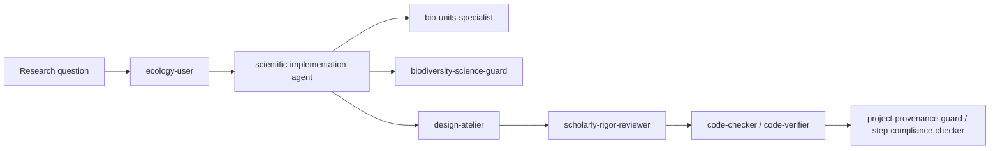

# MacroecologyLab_Agents

This folder is a local staging mirror for the public agent library at `https://github.com/benquist/MacroecologyLab_Agents`.

It contains:

- `agents/` — specialist agent definitions copied from the `biodiversity-agents-lab` workspace.
- `README.md` — a public-facing guide for using the agent library in biodiversity and macroecology projects.

## Purpose

This library is intended to be a shared reference for AI agent roles in ecological research. It documents the agents, their core use cases, and example prompts for new graduate students and collaborators.

## Agent list

The mirror includes the following agents:

- `always`
- `bio-units-specialist`
- `biodiversity-informatics-checker`
- `biodiversity-science-guard`
- `code-checker`
- `code-verifier`
- `coder`
- `design-atelier`
- `ecology-user`
- `EcoInterface`
- `enhanced-theory`
- `long-job-progress-reporter`
- `m`
- `merow-ecology`
- `optimizer`
- `project-provenance-guard`
- `r-code-documenter`
- `scholarly-rigor-reviewer`
- `scientific-implementation-agent`
- `stats-specialist`
- `step-compliance-checker`
- `taxonomy-reconciliation`
- `ter-braak-multivariate`
- `uncertainty-feedback-guard`

Each agent definition file in `agents/` contains the name, description, and suggested use cases.

## Recommended priority agents

For biodiversity and macroecology workflows, the highest-priority agents are:

- `scholarly-rigor-reviewer`
- `scientific-implementation-agent`
- `bio-units-specialist`
- `biodiversity-science-guard`
- `ecology-user`
- `design-atelier`
- `merow-ecology`
- `stats-specialist`
- `r-code-documenter`
- `project-provenance-guard`
- `code-checker`
- `code-verifier`
- `step-compliance-checker`

## How to use this library

This library is designed for new users who want a clear, structured workflow for ecological AI assistance.

### Starter workflow

1. Define your research question and data problem.
2. Use `ecology-user` to classify the data type, scale, biases, and ecological workflow.
3. Use `scientific-implementation-agent` to draft a reproducible analysis plan, file structure, and documentation.
4. Use `bio-units-specialist` during data cleaning when units are missing or inconsistent.
5. Use `biodiversity-science-guard` to audit biodiversity-specific QA, taxonomy, coordinates, and provenance.
6. Use `design-atelier` to improve README or report structure, clarity, and visual flow.
7. Use `scholarly-rigor-reviewer` before publishing or sharing scientific conclusions.
8. Use `code-checker` and `code-verifier` to review code quality.
9. Finish with `step-compliance-checker` and `project-provenance-guard` for final completion and traceability.

## Example prompts

- `ecology-user`: "You are the ecology-user. Given this dataset and research question, identify the data type, scale, likely sampling biases, appropriate analytical framework, uncertainty sources, and an ecological workflow."
- `scientific-implementation-agent`: "You are the scientific-implementation-agent. Create a reproducible R Markdown outline and script plan for trait harmonization, unit inference, QA checks, and output reporting. Include file names and modular functions."
- `bio-units-specialist`: "You are the bio-units-specialist. Infer canonical units for these trait columns, propose conversion factors to standard SI units, flag low-confidence cases, and document biological bounds and citations."
- `biodiversity-science-guard`: "You are the biodiversity-science-guard. Audit this pipeline for Darwin Core compliance, taxonomic uncertainty, coordinate validity, provenance transparency, and ecosystem plausibility. Return critical issues and recommended fixes."
- `design-atelier`: "You are the design-atelier agent. Improve the README or app help page for a biology audience by simplifying the workflow, sharpening headings, adding visual flow, and suggesting diagrams or callouts."
- `scholarly-rigor-reviewer`: "You are the scholarly-rigor-reviewer. Review this text and code comments for unsupported claims, missing citations, reproducibility gaps, and statistical weaknesses. Provide structured feedback under headings."

## Publishing this library

This mirror is currently local. To publish it to the public repo, copy the `MacroecologyLab_Agents/` folder contents to the live repository and push the changes.

## Sync instructions

- Keep `agents/` definitions in sync with the workspace `agents/` folder.
- Update this README whenever the agent list, priorities, or workflow guidance change.
- Preserve prompt provenance in `agents/prompt_log.md` and `agents/agent_chat_provenance_log.txt` when agent-related content is updated.
