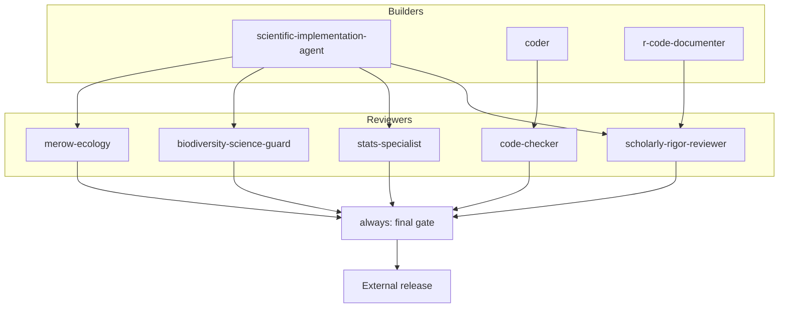
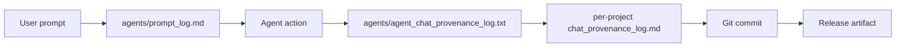

# MacroecologyLab_Agents

A teaching library of AI agents for ethical, reproducible ecology and macroecology.

> **Who this is for:** first-year PhD students and new collaborators learning to use AI coding agents responsibly in ecological research.
> **What you'll learn:** how to scope a question, build with a *builder* agent, audit with *reviewer* agents, and never release work without a final human-supervised gate.
> **Time to read:** ~15 minutes.

This repository pairs domain-specific *builder* agents (which draft code, workflows, and documentation) with *reviewer* agents (which audit citations, statistics, units, biodiversity-data handling, and reproducibility). The guiding assumption is simple: **an AI agent can draft, but a human must verify, cite, and sign.**

---

## Part I — Orient

### Quick start

1. **Clone** alongside your research project:
   ```bash
   git clone https://github.com/benquist/MacroecologyLab_Agents.git
   ```
2. **Copy the agent files you need** into your project's `agents/` (and `.github/agents/` where applicable). Start with `scientific-implementation-agent`, `scholarly-rigor-reviewer`, and `always`.
3. **Use the standard workflow** below: scope → build → audit → final gate. Log every prompt in `agents/prompt_log.md`.

### Worked example — SDM for *Eschscholzia californica*

A first end-to-end pass that maps current and 2070 climatic suitability of California poppy. Read this *before* the abstract guidance below — the case teaches the workflow.

**Step 1 — `ecology-user` (scope the question)**
> "I want to map current and 2070 climatic suitability for *Eschscholzia californica* in California. Help me scope objective, accessible area, predictor set, partitioning strategy, and what claims I'm allowed to make."

*Why first:* pin down the question and the boundary of defensible claims before any code is written.

**Step 2 — `scientific-implementation-agent` (build)**
> "Implement a reproducible SDM pipeline in R: GBIF/BIEN pull with provenance, spatial thinning, target-group background, WorldClim v2.1 predictors clipped to accessible area, MaxEnt + GLM ensemble, spatial-block CV, response curves, MESS mask, and exported diagnostics CSVs."

*Why:* generate a reproducible pipeline, not a one-off script.

**Step 3 — `merow-ecology` (ecological audit)**
> "Audit this SDM for ecological defensibility: is the calibration region justified, are predictors mechanistically relevant, is partitioning appropriate for the projection scenario, and is extrapolation risk reported and masked?"

*Why:* ensure the model is ecologically — not just statistically — defensible.

**Step 4 — `scholarly-rigor-reviewer` (rigor audit)**
> "Before I share this notebook with my advisor / push to GitHub, audit citations, statistical claims, uncertainty reporting, and reproducibility. Flag any unverified DOIs or overstated conclusions."

*Why:* catch fabricated citations, overclaiming, and missing uncertainty.

**Step 5 — `always` (final gate)**
> "Run final pre-release gate: verify provenance log, build status, citation verification status, and push status. Return PASS or BLOCKED."

*Why:* nothing leaves the bench until this returns PASS.

---

## Part II — Catalog

### Agent catalog

Featured agents (★) are the highest-priority for biodiversity workflows. Click an agent name to open its definition.

| Agent | Role | When to invoke | Pairs with |
|---|---|---|---|
| ★ [`always`](agents/always.agent.md) | Final pre-return gate | Before every return to user | All builders + reviewers |
| ★ [`bio-units-specialist`](agents/bio-units-specialist.agent.md) | Audit units & dimensional consistency | Quantitative trait or scaling work | `scientific-implementation-agent` |
| [`biodiversity-informatics-checker`](agents/biodiversity-informatics-checker.agent.md) | Check Darwin Core, GBIF/BIEN handling | Ingesting occurrence data | `taxonomy-reconciliation` |
| ★ [`biodiversity-science-guard`](agents/biodiversity-science-guard.agent.md) | Guard ecological interpretation | Any biodiversity claim | `scholarly-rigor-reviewer` |
| ★ [`code-checker`](agents/code-checker.agent.md) | Static code review | After any code change | `code-verifier` |
| ★ [`code-verifier`](agents/code-verifier.agent.md) | Run and verify code outputs | Before merging code | `code-checker` |
| [`coder`](agents/coder.agent.md) | Minimal idiomatic implementation | Small, well-scoped coding tasks | `code-checker` |
| ★ [`design-atelier`](agents/design-atelier.agent.md) | UI/figure/Shiny design review | Visualization and app polish | `r-code-documenter` |
| ★ [`ecology-user`](agents/ecology-user.agent.md) | Scope research question | Project kickoff | `scientific-implementation-agent` |
| [`EcoInterface`](agents/EcoInterface.agent.md) | Ecology-facing interface conventions | Apps and reports | `design-atelier` |
| [`enhanced-theory`](agents/enhanced-theory.agent.md) | Theoretical-ecology framing | Linking results to theory | `merow-ecology` |
| [`long-job-progress-reporter`](agents/long-job-progress-reporter.agent.md) | Structured progress for long jobs | Multi-hour ETL/model runs | `scientific-implementation-agent` |
| [`m`](agents/m.agent.md) | Multi-step orchestration | Complex multi-agent tasks | All |
| ★ [`merow-ecology`](agents/merow-ecology.agent.md) | SDM/niche defensibility audit | Any species distribution model | `stats-specialist` |
| [`optimizer`](agents/optimizer.agent.md) | Improve structure & clarity | Polishing documents and READMEs | `design-atelier` |
| ★ [`project-provenance-guard`](agents/project-provenance-guard.agent.md) | Ensure per-project logs updated | Before commit | `step-compliance-checker` |
| ★ [`r-code-documenter`](agents/r-code-documenter.agent.md) | Document R code with rationale | After R code stabilizes | `code-checker` |
| ★ [`scholarly-rigor-reviewer`](agents/scholarly-rigor-reviewer.agent.md) | Audit citations, stats, claims | Before any external release | `stats-specialist` |
| ★ [`scientific-implementation-agent`](agents/scientific-implementation-agent.agent.md) | Build reproducible workflows | Primary builder | All reviewers |
| ★ [`stats-specialist`](agents/stats-specialist.agent.md) | Review statistical inference | Any modeling step | `scholarly-rigor-reviewer` |
| ★ [`step-compliance-checker`](agents/step-compliance-checker.agent.md) | Verify steps were performed | Before final gate | `always` |
| [`taxonomy-reconciliation`](agents/taxonomy-reconciliation.agent.md) | Reconcile names against TNRS/WCVP | Merging name-based data | `biodiversity-informatics-checker` |
| [`ter-braak-multivariate`](agents/ter-braak-multivariate.agent.md) | Multivariate ordination guidance | Community-ecology analyses | `stats-specialist` |
| [`uncertainty-feedback-guard`](agents/uncertainty-feedback-guard.agent.md) | Force explicit uncertainty | Any predictive output | `merow-ecology` |

*Caption: the catalog separates featured (★) agents — required for most biodiversity workflows — from supporting agents used in specific tasks.*

---

## Part III — Use

### Standard workflow



*Caption: builders draft; reviewers audit; nothing reaches external release without `always` returning PASS.*

The same flow as a checklist:

1. **Scope** with `ecology-user` → research question and allowed claims.
2. **Build** with `scientific-implementation-agent` → reproducible code and workflow.
3. **Domain audit** with `bio-units-specialist` and `biodiversity-science-guard`.
4. **Visual/UX review** with `design-atelier`.
5. **Rigor audit** with `scholarly-rigor-reviewer`.
6. **Code audit** with `code-checker` and `code-verifier`.
7. **Provenance** with `project-provenance-guard` and `step-compliance-checker`.
8. **Final gate** with `always` → PASS / BLOCKED.

### Prompt patterns

**Template**

> "You are the {agent-name}. Given {inputs}, perform {scoped task}. Return {structured output}. Do not invent citations, DOIs, URLs, or numerical results."

**Example A — `bio-units-specialist`**

> "You are the `bio-units-specialist`. Given this allometric regression of leaf mass (g) on leaf area (cm²) with slope 0.74, perform a dimensional consistency check and verify that the reported scaling exponent is unit-invariant. Return a structured report with: detected units, dimensional issues, recommended corrections, and any flagged inconsistencies. Do not invent citations, DOIs, URLs, or numerical results."

**Example B — `biodiversity-science-guard`**

> "You are the `biodiversity-science-guard`. Given this draft results paragraph claiming *Eschscholzia californica* is 'expanding its native range under climate change,' perform a check on native vs. introduced framing, evidentiary support, and overclaim risk. Return a structured report with: claim, evidence available, framing concerns, and a suggested rewording that respects context-dependence. Do not invent citations, DOIs, URLs, or numerical results."

---

## Part IV — Evaluate

### Avoid common pitfalls

Sorted by how often new users hit them.

| Symptom | Fix |
|---|---|
| Hallucinated or unverifiable citations | Verify every DOI on Crossref / DOI.org / OpenAlex before using. |
| Missing or overwritten provenance | Append-only logs; never edit prior entries. |
| Treating agent output as ground truth | Always run the reviewer chain; require `always` PASS. |
| Skipping the rigor-review pass before sharing | `scholarly-rigor-reviewer` is mandatory before any release. |
| Prompt drift across long sessions | Restart the session; re-anchor with the agent file. |
| Scope creep ("just one more thing") | Re-scope with `ecology-user`; do not let the build expand silently. |
| Confusing presence-only AUC with predictive truth | Use spatial-block CV; report AUC with caveats. |
| Global background instead of accessible area (M) | Define and justify M before background sampling. |
| Random CV when projecting in space/time | Use spatial-block or temporal-block CV. |
| Treating WorldClim ~1 km grids as ground truth | Disclose resolution; avoid microhabitat claims. |
| Binary suitability map presented as "the result" | Show continuous suitability + MESS mask. |
| Native-range model used as invasive-range prediction | State scope; do not extrapolate framing. |
| Hidden QA losses or filter cascades | Report counts at every filter step. |

### Evaluate an agent's output

Use this 10-point checklist before accepting any agent output for downstream use.

1. Every citation independently verified on Crossref / DOI.org / OpenAlex.
2. Numerical results traceable to code and data.
3. Uncertainty reported (intervals, CV folds, ensemble spread).
4. Limitations declared (spatial, taxonomic, temporal, sampling).
5. No causal language without a stated identification strategy.
6. Provenance logged.
7. Data licenses respected (FAIR + CARE).
8. Sensitive locality data generalized where required.
9. Code reproducible from a clean environment.
10. `scholarly-rigor-reviewer` and `always` returned PASS.

---

## Part V — Govern

### Use agents ethically

- **No fabricated citations.**
- **No fabricated data or results.**
- **Correlation ≠ causation.**
- **Transparent uncertainty.**
- **Declared limitations.**
- **Provenance preservation (append-only).**
- **Reproducibility by default.**
- **Human accountability** — the researcher, not the agent, is the author.
- **Scope honesty about agents** — disclose what they did and did not do.
- **Bias and representativeness** — interrogate sampling and training-data bias.
- **FAIR + CARE for biodiversity data**, including Indigenous data sovereignty.
- **Conflict-of-interest and authorship transparency.**
- **No bypassing access controls** or exposing sensitive locality data for threatened species.
- **Falsifiability and pre-registration mindset.**
- **Plain-language reporting** of methods, uncertainty, and limits.

### Provenance and logging



*Caption: every release artifact is traceable backward to the prompt that initiated it. Three append-only files form the audit trail; never rewrite prior entries.*

- `agents/prompt_log.md` (create in your project) — every user prompt that drove a change.
- `agents/agent_chat_provenance_log.txt` (create in your project) — agent-file creation/edits.
- `<project>/chat_provenance_log.md` — per-project change record.

### Reproducibility checklist

- [ ] Pinned dependencies (`renv.lock` for R, `environment.yml` for Python).
- [ ] Deterministic random seeds set and recorded.
- [ ] Documented workflow order (README or `Makefile`).
- [ ] Raw / clean / derived data clearly separated.
- [ ] Data version DOIs recorded (e.g., GBIF download DOI, WorldClim version).
- [ ] Code commit hash recorded with each result artifact.
- [ ] Provenance logs append-only and committed.

### Limitations of this agent library

- Agents may produce plausible-looking but incorrect outputs.
- Agents have no access to live databases unless explicitly provided.
- Agent outputs reflect the underlying model's training cutoff.
- The review chain is mandatory, not optional.
- The human researcher remains the responsible author.

### Disclose AI assistance in manuscripts

Paste-ready paragraph:

> *AI-assistance disclosure.* Portions of the code, documentation, and workflow scaffolding for this study were drafted with the assistance of the MacroecologyLab_Agents library (https://github.com/benquist/MacroecologyLab_Agents). The following agents were used at the indicated steps: `<agent-name>` at `<step>` (e.g., `scientific-implementation-agent` for pipeline drafting; `merow-ecology` and `scholarly-rigor-reviewer` for audit; `always` as the final gate). Underlying language model(s): `<model name and version, where known>`. All citations, numerical results, statistical inferences, and figures were independently verified by the human authors, who take full responsibility for the content of the manuscript.

---

## Part VI — Reference

### Glossary

- **Agent** — A scoped instruction file that conditions an LLM to perform a specific scientific or engineering role.
- **Builder agent** — Writes code, workflows, or documentation (e.g., `scientific-implementation-agent`).
- **Reviewer agent** — Audits builder output against scientific, statistical, or reproducibility standards.
- **Final gate** — The `always` agent; nothing returns to the user until it reports PASS.
- **Provenance** — Append-only record of prompts, agent actions, and project changes.
- **Accessible area (M)** — In SDM, the region a species could plausibly have reached; the correct background-sampling extent.
- **MESS** — Multivariate Environmental Similarity Surface; flags extrapolation beyond training conditions.
- **FAIR** — Findable, Accessible, Interoperable, Reusable data principles.
- **CARE** — Collective benefit, Authority to control, Responsibility, Ethics — Indigenous data governance.
- **ODMAP** — Overview, Data, Model, Assessment, Prediction reporting protocol for SDMs.

### References

Each entry below was reviewed by `scholarly-rigor-reviewer` as high-confidence at the time of writing. **Students must independently re-verify every DOI on Crossref or DOI.org before citing in a manuscript.**[^verify]

- Wilkinson, M.D., et al. (2016). The FAIR Guiding Principles for scientific data management and stewardship. *Scientific Data* 3:160018. https://doi.org/10.1038/sdata.2016.18
- Wilson, G., et al. (2017). Good enough practices in scientific computing. *PLOS Computational Biology* 13(6):e1005510. https://doi.org/10.1371/journal.pcbi.1005510
- Munafò, M.R., et al. (2017). A manifesto for reproducible science. *Nature Human Behaviour* 1:0021. https://doi.org/10.1038/s41562-016-0021
- Araújo, M.B., et al. (2019). Standards for distribution models in biodiversity assessments. *Science Advances* 5:eaat4858. https://doi.org/10.1126/sciadv.aat4858
- Zurell, D., et al. (2020). A standard protocol for reporting species distribution models (ODMAP). *Ecography* 43:1261–1277. https://doi.org/10.1111/ecog.04960
- Darwin Core (TDWG). https://dwc.tdwg.org/
- GBIF Best Practice Guides. https://www.gbif.org/standards
- The Turing Way community handbook. https://the-turing-way.netlify.app/

> **Note on CARE Principles.** The CARE Principles for Indigenous Data Governance (Carroll et al. 2020) are referenced throughout this document but the specific DOI must be verified by the user before citation.

[^verify]: Re-verify DOIs at https://doi.org/ or https://www.crossref.org/ before submission. Do not copy citations from this README into a manuscript without checking.

### Contributing & sync

- This library mirrors the agent definitions maintained in the upstream biodiversity workspace.
- New or updated agents should be added to both `agents/` and `.github/agents/` where visibility matters.
- Open a pull request with: (1) the agent file, (2) a short rationale, (3) at least one example prompt, (4) an entry appended to `agents/agent_chat_provenance_log.txt`.
- Reviewer agents should themselves be reviewed by at least one human before merge.
- Do not remove or rewrite prior provenance entries.

### License

**License:** *PLACEHOLDER — to be confirmed by the maintainer.* Until a license file is added, treat this repository as "all rights reserved" and contact the maintainer before redistribution.

### How to cite

```bibtex
@misc{macroecologylab_agents,
  title        = {MacroecologyLab_Agents: A teaching library of AI agents for ethical, reproducible ecology and macroecology},
  author       = {Enquist, Brian J. and contributors},
  year         = {YYYY},
  howpublished = {\url{https://github.com/benquist/MacroecologyLab_Agents}},
  note         = {Version VERSION. PLACEHOLDER — confirm year, version, and author list with maintainer.}
}
```
